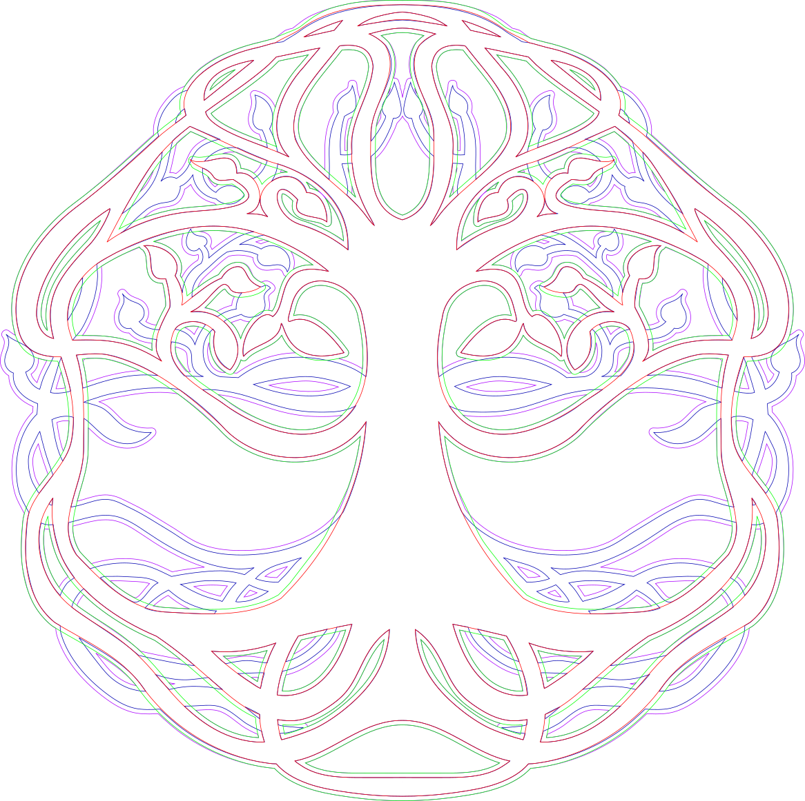
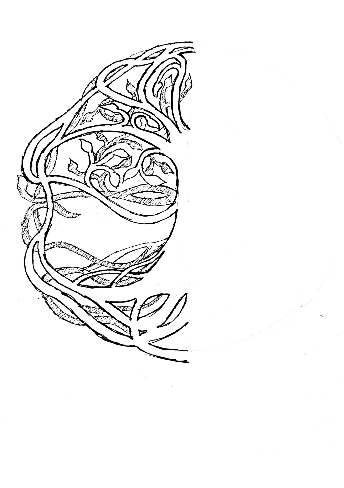

# Tree-of-Life
Design I made of a tree of life with layers to be laser cut. 
The final result of all the layers looks something like this:

Tree.svg is the main inkscape file. The DXFs were made for each layer to import to Solidworks so that they could be 3D printed. 

The ordering goes as followed from top to bottom: Red, Gree, Blue, Purple. 

The original design that I drew was this: 

